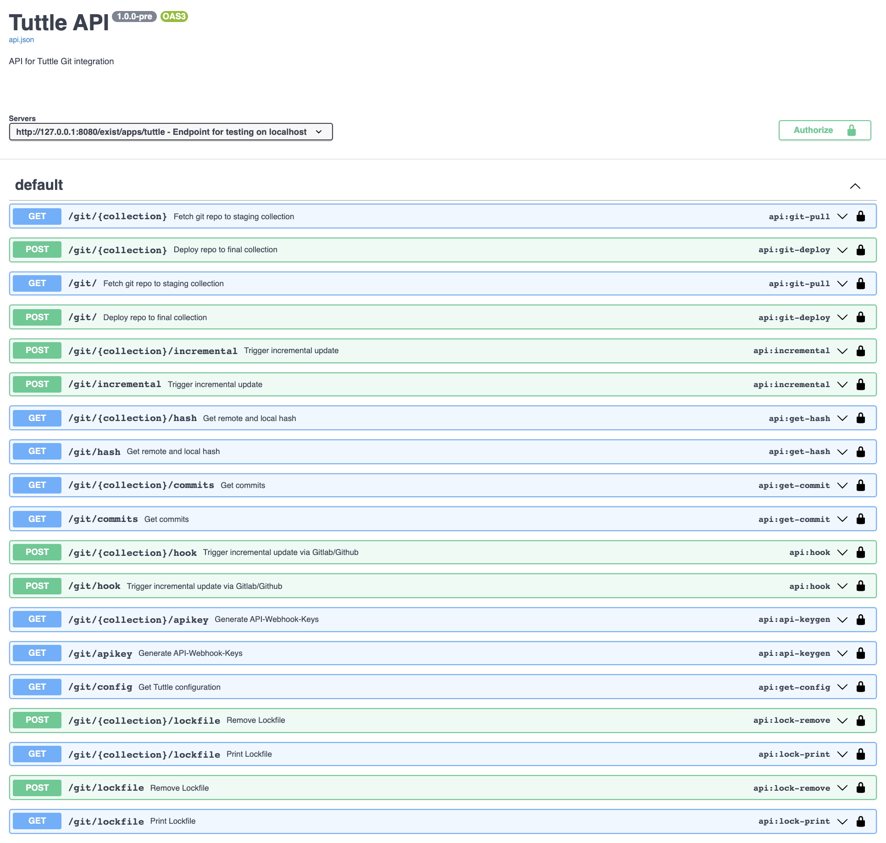

 
# Tuttle - a Git-integration for eXist-db

Synchronizes your data collection with GitHub and GitLab.

## User Documentation

[User Documentation](https://eeditiones.github.io/tuttle-doc/)

## Functionality

* Sync data colleciton from Git to DB
* Deal with Multi repository
* Incremental updates

## Requirements

-  [node](https://nodejs.org/en/): `v12+`
-  [exist-db](https://www.exist-db.org): `v5.3.0+` (works with Version [GITSHA: 4a8124](https://github.com/eXist-db/exist#4a8124))
-  the data xar containing the target collection must be installed prior to using Tuttle
-  Authtoken for git repository to use

## Current restrictions

In version 1.1.1 not implemented:
-  webhooks are not fully implemented.

## Building and Installation

Tuttle uses Gulp as its build tool which itself builds on NPM. 
To initialize the project and load dependencies run

```npm i```

> Note: the `install` commands below assume that you have a local eXist-db running on port 8080. However the database connection can be modified in .existdb.json.

| Run | Description |
|---------|-------------|
|```gulp build```|to just build Tuttle. |
|```gulp install```|To build and install Tuttle in one go|

The resulting xar(s) are found in the root of the project.

## Testing

To run the local test suite you need an instance of eXist running on `localhost:8080` and `npm` to be available in your path. 
Run tests  with ```npm test```

## Configuration

Tuttle is configured in `data/tuttle.xml`. 

### Gitservice configuration 
@name is always the name of the destination collection.  It will be configured in `data/tuttle.xml`

An example:
```xml
      <repos>
    <collection name="tuttle-sample-data">
        <default>true</default>
        <type>github</type>
        <baseurl>https://api.github.com/</baseurl>
        <repo>tuttle-sample-data</repo>
        <owner>tuttle-sample-data</owner>
        <token>XXX</token>
        <ref>master</ref>
        <hookuser>admin</hookuser>
        <hookpasswd></hookpasswd>
    </collection>
    
   <collection name="tuttle-sample-gitlab">
        <type>gitlab</type>
        <baseurl>https://gitlab.com/api/v4/</baseurl>
        <project-id>tuttle-sample-data</project-id>
        <token>XXX</token>
        <ref>master</ref>
        <hookuser>admin</hookuser>
        <hookpasswd></hookpasswd>
    </collection>
  </repos>
```

#### type
Gitserver type:  'github' or 'gitlab'

####  baseurl
* For github the baseurl is always api.github.com
* For gitlab the url can also be your private gitlab server egg 'https://gitlab.existsolutions.com/api/v4/'

####  repo, owner and project-id
 * For github you have to spezifie the ower and the repo
 * For gitlab you have to spezifie the project-id of the repository

#### ref 
Define the working branch of the git repository

#### hookuser & hookpasswd (future use not implemented yet)
tba

## Dashboard

The dashboard can trigger a full deployment or an incremental update. 
Full deployment clones the repository from git and install it as a xar.
With incremental update only the changes to the database collection are applied.

### Lets start

1) customize the configuration (modules/config.xql)
2) click on 'full' to trigger a full deployment from git to existdb
3) now you can update your collection with a click on 'incremental'

**REMARK: A valid expath-pkg.xml and repo.xml must be present**

**REMARK: Only use it with data collections**

## API

The page below is reachable via [api.html](api.html) in your installed tuttle app. 



### API endpoint description

Calling the API without {collection} ``config:default-collection()`` is chosen. 

#### Fetch to staging collection

`` GET ~/tuttle/{collection}/git``

With this most basic endpoint the complete data repository is pulled from the gitservice.
The data will not directly update the target collection but be stored in a staging
collection. 

To update the target collection use another POST request to `/tuttle/git`.

The data collection is stored in `/db/app/sample-collection-staging`.

#### Deploy the collection

`` POST ~/tuttle/{collection}/git``

The staging collection `/db/app/sample-collection-staging` is deployed to `/db/app/sample-collection`. All permissions are set and a pre-install function is called if needed.

#### Incremental update

`` POST ~/tuttle/{collection}/git``

All commits since the last update are applied.To ensure the integrity of the collection, all commits are deployed individually.

#### Get the repository hashed

`` GET ~/tuttle/{collection}/hash``

Reports the GIT hashed of all participating collections and the hash of the remote repository.

#### Get Commits

`` GET ~/tuttle/{collection}/commits``

Displays all commits with commit message of the repository. 

#### Hook Trigger

`` GET ~/tuttle/{collection}/hook``

The webhook is usually triggered by GitHub or GitLab.
An incremental update is triggered.
Authentication is done by APIKey. The APIKey must be set in the header of the request.

#### Example für GitLab
``` curl --header 'X-Gitlab-Token: RajWFNCILBuQ8SWRfAAAJr7pHxo7WIF8Fe70SGV2Ah' http://127.0.0.1:8080/exist/apps/tuttle/git/hook```

### Generate the APIKey

`` GET ~/tuttle/{collection}/apikey``

The APIKey is generated and displayed once. If forgotten, it must be generated again.


### Display the Repository configuration and status

`` GET ~/tuttle/config ``

Displays the configuration and the state of the git repository.

States:
 - uptodate: Collection is up to date with GIT
 - behind: Collection is behind GIT and need an update
 - new: Collection is not a tuttle collection, full deployment is needed

```xml
<tuttle>
  <default>sample-collection-github</default>
  <repos>
    <repo type="github" url="https://github.com/Jinntec/tuttle-demo" ref="master" collection="sample-collection-github" status="uptodate"/>
    <repo type="gitlab" url="https://gitlab.com/tuttle-test/tuttle-demo.git" ref="master" collection="sample-collection-gitlab" status="uptodate"/>
  </repos>
</tuttle>
```

### Remove Lockfile

`` POST ~/tuttle/{collection}/lockfile ``

Remove lockfile after anythig goes wrong.

#### Print Lockfile

`` GET ~/tuttle/{collection}/lockfile ``

The running task is stored in the lockfile. It ensures that two tasks do not run at the same time.


## Access token for gitservice (incomplete)

To talk to the configured gitservice Tuttle needs an access token. These can
be obtained from the respective service.

* see [Creating a personal access token](https://docs.github.com/en/github/authenticating-to-github/creating-a-personal-access-token) for github
* see [Personal access tokens](https://docs.gitlab.com/ee/user/profile/personal_access_tokens.html) for Gitlab

The key for the gitservice must be configured in Gitservice configuration as shown above.


## DB to Git

Will be implemented in release 2.0.0

## Honorable mentions:


[Horace Parnell Tuttle - American astronomer](http://www.klima-luft.de/steinicke/ngcic/persons/tuttle.htm)

[Archibald "Harry" Tuttle - Robert de Niro in Terry Gilliams' 'Brazil'](https://en.wikipedia.org/wiki/Brazil_(1985_film))
